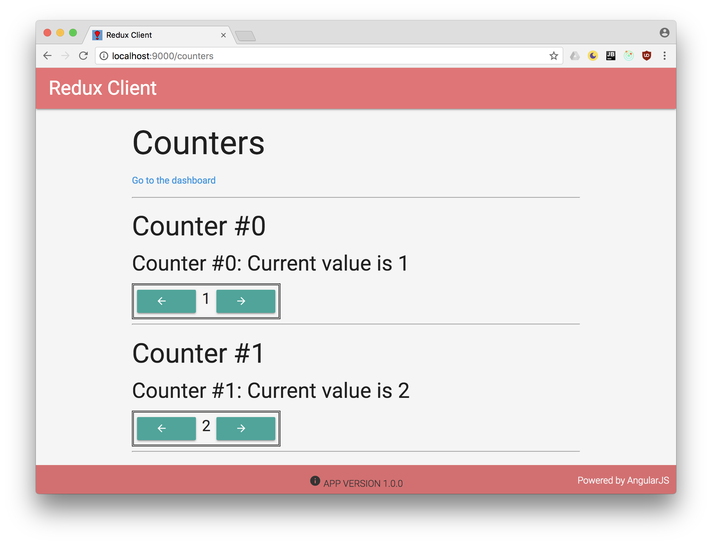

# AngularJS Redux Client

This is a single-page applicaton written in TypeScript
using AngularJS. It retrieves counters from a REST service
and displays them. You can increase and decrease each counter's
value. A second page displays a little dashboard that does
some analytics on your counters and their values.

For an app with a prettier UI, have a look at the
[implementation](https://github.com/MichaelKaaden/redux-client-ng5)
using Angular instead.

## Purpose

I wanted to learn more about the Redux architectural pattern
to solve common problems like the same data being used in
multiple components. Changes in one component would not update
the other component's data, so one would either have to deal
with this chaos or notify the other components about change
with e. g. events. This is complicated, error-prone and very
ugly. Redux perfectly solves this problem. So I wrote this
app together with the server side which you can find 
[here](https://github.com/MichaelKaaden/redux-server).

The app utilizes
[ng-redux](https://github.com/angular-redux/ng-redux).
For asynchronous action like loading and saving counters
from and to the REST service, it uses
[redux-thunk](https://github.com/gaearon/redux-thunk).

## Development server

Run `yarn dev` to run the app in development mode
or `yarn prod` for production mode.
